# Spotify-KW App

Spotify-KW App ialah tiruan sederhana dari Spotify App. Pada aplikasi ini, setelah melakukan login, maka kita akan bisa mencari lagu yang kita inginkan dan menambahkannya diplaylist baru. 

## Features

1. Fitur Login ke Spotify agar bisa mengakses halaman Create Playlist
2. Fitur Membuat Playlist Baru
Dengan title minimal 10 karakter dan playlist private. Pada halaman ini, user bisa melihat nama akun serta photo profile akun spotifynya
3. Fitur Mencari Lagu 
Lagu hasil pencarian akan terlihat foto album, judul lagu, nama penyanyi serta durasi lagunya
4. Fitur Memilih lagu dan menambahkannya ke Playlist Baru
Dilengkapi dengan fitur select dan deselect
5. Fitur Melihat daftar Playlist yang dimiliki
6. Fitur Logout

## Technical Requirements

- Create-react-app, React, Typescript, JavaScript
- Styling: CSS Flex & Grid
- Menggunakan Redux & Hooks
- Testing: Testing-Library
- ESLint gak ada warning
- Deployment: Vercel

## How to run this repo
1. Lakukan clone pada repo ini

```bash
git clone https://github.com/hanifaafauziah/gigih-project.git
```

2. Pindah ke directory repo ini 

```bash
cd gigih-project
```

3. Lakukan install

```bash
npm install
```

4. Lakukan setting pada Spotify Developers API dan tambahkan redirect url
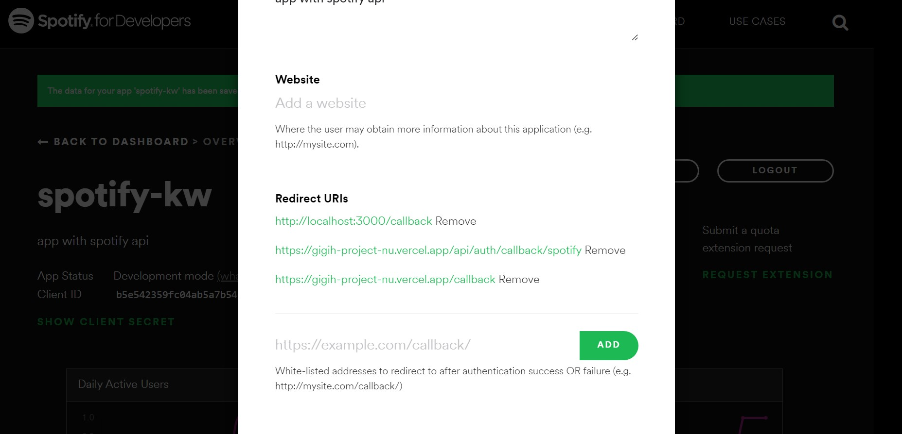

5. Jalankan aplikasi

```bash
npm start
```


## How to use Spotify-KW App
- Login dengan akun spotify kamu


- Klik Agree pada halaman autentikasi
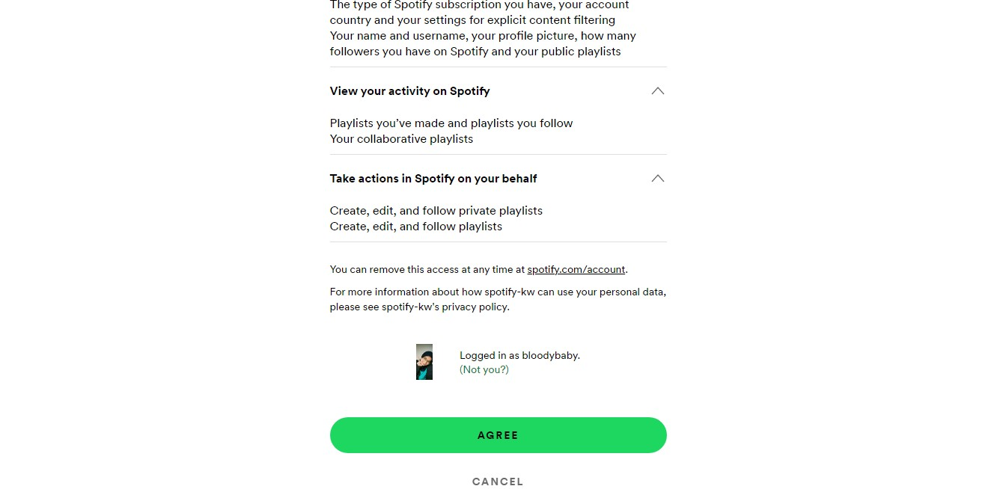

- Jika sudah login, kamu akan diarahkan ke halaman Create Playlist dimana pada bagian header akan selalu menampilkan nama akun dan photo profile
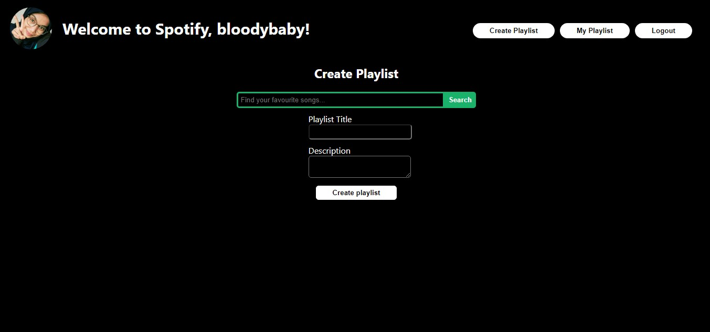

- Dihalaman ini kamu bisa mencari lagu yang ingin kamu tambahkan ke Playlist Baru 
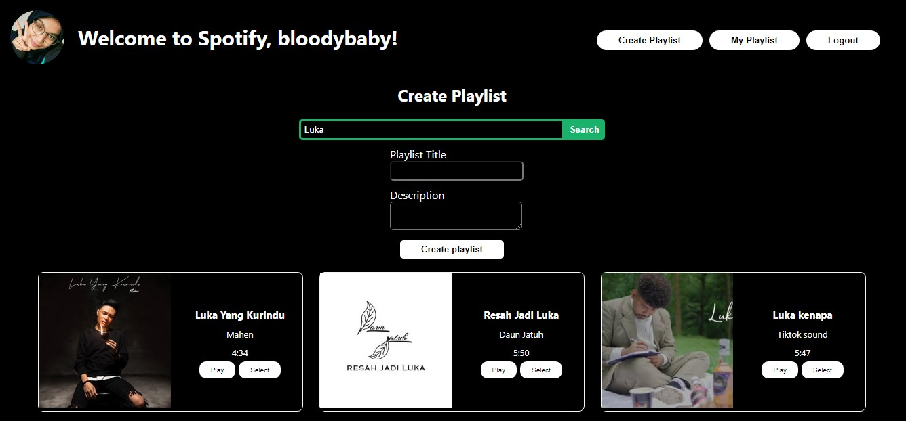

- Lagu yang ada tidak hanya bisa di select untuk ditambahkan ke playlist, tapi juga bisa didengarkan dengan menekan tombol play yang mana nantinya akan diarahkan ke web resmi spotify
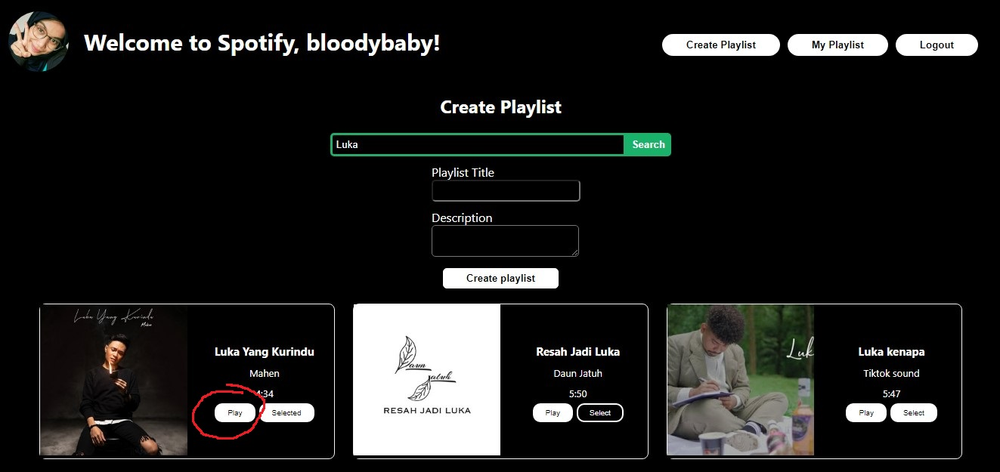
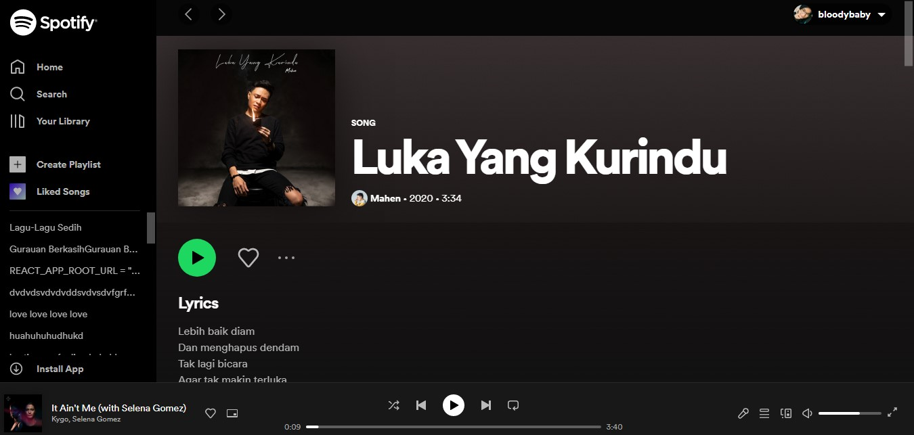

- Lakukan select untuk memilih lagu
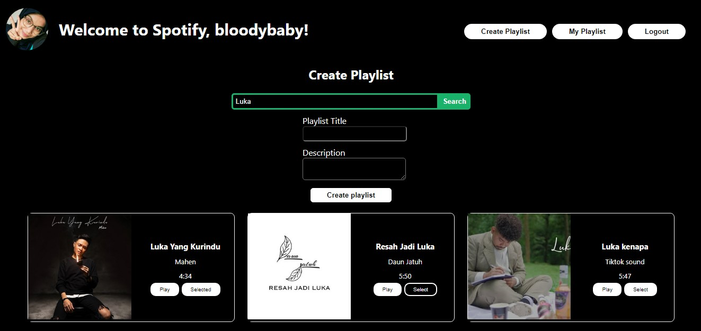

- Klik tulisan selected jika tidak jadi memilih lagu, maka tombol akan kembali menjadi select lagi
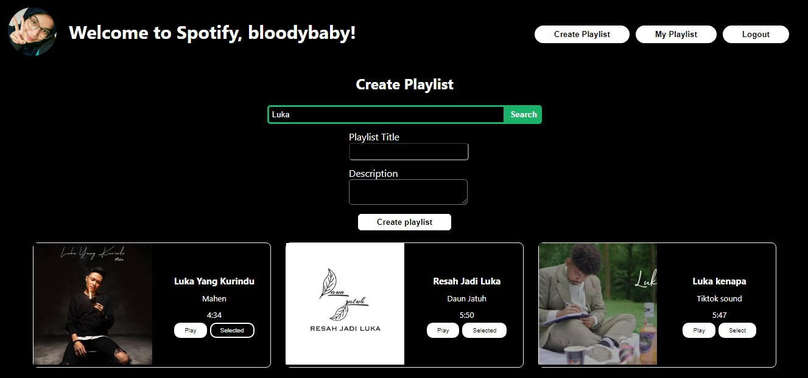


- Isi title dan description sesuai yang diinginkan, dimana title minimal ada 10 karakter, lalu klik tombol create playlist
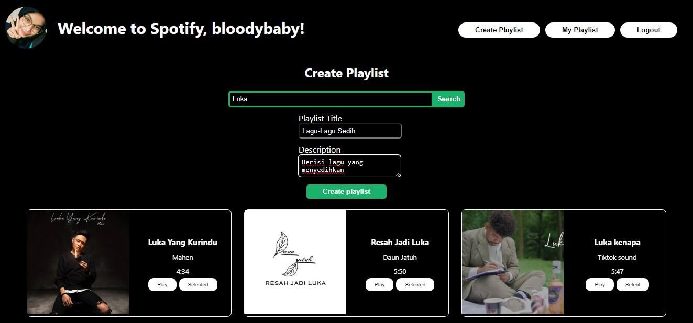

- Maka akan muncul tampilan alert pemberitahuan bahwa playlist sudah dibuat
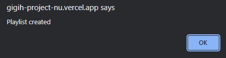

- Halaman akan diarahkan ke halaman my playlist, disini bisa melihat playlist yang kita miliki. Halaman ini juga bisa diakses dengan melakukan klik pada tombol My Playlist
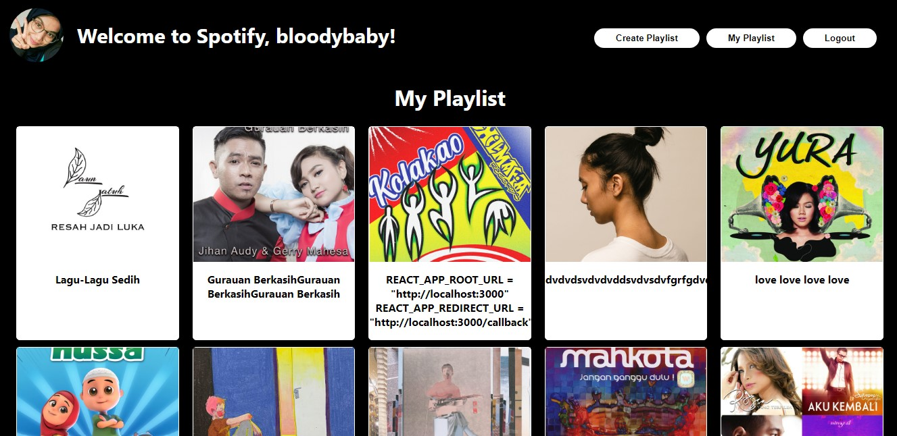

- Jika sudah, maka bisa melakukan logout dengan melakukan klik pada tombol logout
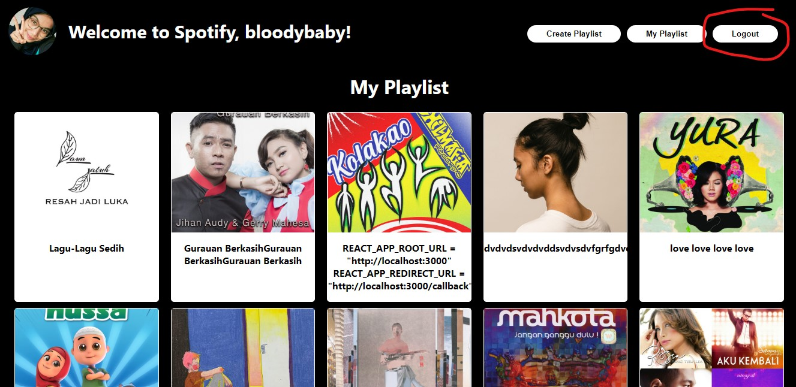
